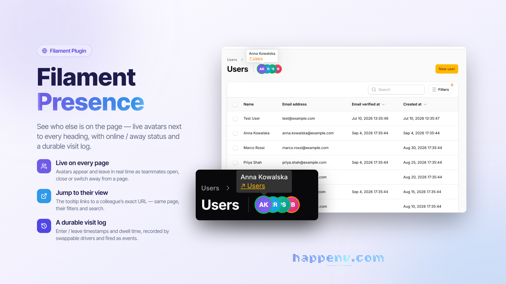

# Filament Presence

<div class="filament-hidden">



</div>

[](https://github.com/happenv-com/filament-presence/releases)
[](https://github.com/happenv-com/filament-presence/actions/workflows/tests.yml)
[](https://github.com/happenv-com/filament-presence/actions/workflows/phpstan.yml)
[](https://github.com/happenv-com/filament-presence/actions/workflows/quality.yml)
[](https://packagist.org/packages/happenv-com/filament-presence)
[](https://github.com/happenv-com/filament-presence/blob/1.x/LICENSE.md)

Live "who's on this page" avatars for Filament panels, plus a durable session log
(enter/leave timestamps and dwell time) exposed as domain events.

Each page renders a stacked row of avatars next to its heading, updated in real time
as users open, leave, or switch away from the page. Built on Laravel broadcasting
(Echo presence channels), so it works with Reverb, Pusher, or Ably.

```php
use Happenv\FilamentPresence\FilamentPresencePlugin;

$panel->plugin(FilamentPresencePlugin::make());
```

## Key features

- **Presence on every page, with no per-page wiring.** Avatars are injected next to the page heading on every page type (list / create / edit / custom).
- **Real-time join and leave.** Native Echo presence channels add and remove avatars the moment users open or close a page.
- **Online / away status.** A green / amber ring driven by the Page Visibility API marks a user away when they switch tab or window; closing the tab removes them.
- **Jump to where a colleague is.** The tooltip shows the user's name and an optional "go to their view" link to their exact URL, shown only when it differs from yours.
- **A durable session log.** Swappable drivers (`database`, `activitylog`, or `null`) record every visit and dispatch `UserEnteredPage` / `UserLeftPage` events — see [Session log & events](#session-log--events).
- **Per-page opt-in / opt-out.** One trait method turns presence on or off for a page — see [Per-page opt-in](#per-page-opt-in).
- **64 languages.** The indicator's strings ship in every locale Filament ships — see [Translations](#translations).
- **Fits any layout.** The layout is RTL-aware and the avatar size is configurable.
- **Every moving part is swappable.** Channel naming, member data, the room-key strategy, the recorder and the model are resolved from the container, so you can replace them without touching package code — see [Extension points](#extension-points).

## Requirements

| Package  | Versions                        |
|----------|---------------------------------|
| PHP      | 8.3 – 8.5                       |
| Laravel  | 11, 12, 13 (CI runs 12 and 13)  |
| Filament | 4 (`^4.11`), 5 (`^5.6`)         |

The avatars also need a configured Laravel Echo client (`window.Echo`) backed by Reverb, Pusher, or Ably, with broadcasting authentication set up.

## Installation

Install the package via Composer:

```bash
composer require happenv-com/filament-presence
```

The default recorder writes to a `presence_sessions` table. Publish and run the migration:

```bash
php artisan vendor:publish --tag=filament-presence-migrations
php artisan migrate
```

> [!IMPORTANT]
> If you have not set up a custom theme and are using Filament Panels, follow the instructions in the [Filament docs](https://filamentphp.com/docs/5.x/styling/overview#creating-a-custom-theme) first.

Add the package's views to your theme's CSS file, so Tailwind generates the classes they use:

```css
@source '../../../../vendor/happenv-com/filament-presence/resources/**/*.blade.php';
```

Register the plugin on your panel:

```php
use Filament\Panel;
use Happenv\FilamentPresence\FilamentPresencePlugin;

public function panel(Panel $panel): Panel
{
    return $panel->plugin(FilamentPresencePlugin::make());
}
```

That's it — every page in the panel now shows presence avatars. By default member
data comes from the authenticated user's `getFilamentAvatarUrl()` and `name`.

## Configuration

Optionally publish the config:

```bash
php artisan vendor:publish --tag=filament-presence-config
```

`config/filament-presence.php`:

| Key | Default | Description |
| --- | --- | --- |
| `recorder` | `database` | Session-log driver: `database`, `activitylog`, or `null`. |
| `table` | `presence_sessions` | Table used by the database recorder. |
| `default_opt_in` | `true` | When `false`, presence is off unless a page opts in. |
| `show_self` | `false` | Show the current user's own avatar. |
| `max_visible_avatars` | `5` | Avatars shown before collapsing into a `+N` chip. |
| `avatar_size` | `22` | Avatar diameter in pixels. |
| `heartbeat_interval` | `30` | Client heartbeat cadence (seconds). |
| `stale_after_seconds` | `90` | Server-side cutoff for closing stale sessions. |
| `guard` | `null` | Auth guard for the log routes (`null` = default guard). |
| `reload_on_session_expiry` | `true` | Reload the tab (onto the login screen) once the session has expired. The client always stops its loop and dispatches `filament-presence:session-expired` on `window`; switch this off to handle expiry yourself. |
| `middleware` | `['web', 'auth']` | Middleware group for the log routes. |
| `route_prefix` | `filament-presence` | URL prefix for the log routes. |
| `register_default_channel` | `true` | Register the bundled presence channel (disable if you register your own). |

## Usage

### How it works

Two decoupled layers:

- **Live (ephemeral):** native Echo presence channels (`here` / `joining` / `leaving`) drive the avatars. No database involved.
- **Durable:** a `PresenceRecorder` is fed by lightweight `enter` / `heartbeat` / `leave` HTTP calls and records each visit. A scheduled command closes sessions whose heartbeat went stale (closed laptop, crash) so timestamps stay accurate even without a clean exit.

The two layers are independent: avatars keep working if the log backend is down, and
the log stays correct even when the browser never fires `beforeunload`.

### Per-page opt-in

Toggle presence per page with the `InteractsWithPresence` trait:

```php
use Happenv\FilamentPresence\Concerns\InteractsWithPresence;

class EditOrder extends EditRecord
{
    use InteractsWithPresence;

    public function shouldCollectPresence(): bool
    {
        return false; // disable presence on this page
    }
}
```

Without the trait, pages follow `default_opt_in`.

### Session log & events

The active recorder records every visit and dispatches plain Laravel events you can
listen to:

```php
use Happenv\FilamentPresence\Events\UserEnteredPage;
use Happenv\FilamentPresence\Events\UserLeftPage;

// UserEnteredPage->visit                       (userId, roomKey, url, label, enteredAt)
// UserLeftPage->visit, ->leftAt, ->durationSeconds
```

Drivers:

- `database` — open/close rows in `presence_sessions`; queryable, exact durations.
- `activitylog` — logs `entered` / `left` activities via `spatie/laravel-activitylog` (install it to use this driver).
- `null` — live avatars only, no persistence.

#### Closing stale sessions

Schedule the cleanup command so ungraceful exits are still closed:

```php
// routes/console.php
Schedule::command('presence:close-stale')->everyMinute();
```

### Extension points

Bind your own implementations in a service provider; the package binds defaults with
`bindIf`, so your bindings always win.

| Contract / class | Purpose | Default |
| --- | --- | --- |
| `Contracts\ResolvesPresenceMember` | Build the presence payload (id, name, avatar, profile URL) from a user. | reads `getFilamentAvatarUrl()` + `name` |
| `Contracts\ResolvesPresenceChannel` | The logical channel name per request (inject a tenant prefix here). | `filament-presence.{roomKey}` |
| `Contracts\DerivesRoomKey` | Turn a request path into a channel-safe room key. | slug + hash of the path |
| `Contracts\PresenceRecorder` | The session-log backend. | selected via `recorder` config |
| `Models\PresenceSession` | The Eloquent model for the database recorder. | integer key; bind a subclass for UUIDs/custom table |

```php
$this->app->bind(
    \Happenv\FilamentPresence\Contracts\ResolvesPresenceMember::class,
    MyMemberResolver::class,
);
```

#### Custom presence channel

The package registers `filament-presence.{roomKey}` out of the box. To use your own
channel (e.g. tenant-namespaced), set `register_default_channel` to `false` and
register it yourself, delegating authorization to the package:

```php
use Happenv\FilamentPresence\PresenceChannel;
use Illuminate\Support\Facades\Broadcast;

Broadcast::channel('my-prefix.{roomKey}', fn ($user, string $roomKey) =>
    PresenceChannel::authorize($user, $roomKey)
);
```

Then return the matching name from your `ResolvesPresenceChannel` so the client
subscribes to the same channel.

## Translations

The indicator's own strings — the "go to their view" link and the fallback name for a member without one — ship in every locale Filament ships:

`am` `ar` `az` `bg` `bn` `bs` `ca` `ckb` `cs` `da` `de` `el` `en` `es` `et` `eu` `fa` `fi` `fil` `fr` `he` `hi` `hr` `hu` `hy` `id` `it` `ja` `ka` `km` `ko` `ku` `lt` `lus` `lv` `mk` `mn` `ms` `my` `nb` `ne` `nl` `pl` `pt` `pt_BR` `ro` `ru` `sk` `sl` `sq` `sr_Cyrl` `sr_Latn` `sv` `sw` `tg` `th` `tr` `uk` `ur` `uz` `vi` `zh_CN` `zh_HK` `zh_TW`

The app locale picks the language; the page label in the tooltip is the page's own (already translated) title. Publish the files to change a string or add a language:

```bash
php artisan vendor:publish --tag=filament-presence-translations
```

## Development

```bash
composer test          # unit and feature tests
composer phpstan       # static analysis
composer cs            # fix code style: composer normalize, Rector, Pint
composer ci            # everything CI checks, locally
```

The suite runs on Testbench with an in-memory SQLite database — no Filament panel
required.

## Upgrading

Breaking changes and how to migrate are described in [UPGRADING](https://github.com/happenv-com/filament-presence/blob/1.x/UPGRADING.md) for every major version.

## Changelog

See [CHANGELOG](https://github.com/happenv-com/filament-presence/blob/1.x/CHANGELOG.md) and [GitHub releases](https://github.com/happenv-com/filament-presence/releases) for what has changed recently.

## Contributing

See [CONTRIBUTING](https://github.com/happenv-com/filament-presence/blob/1.x/.github/CONTRIBUTING.md) for details.

## Security vulnerabilities

Please review [our security policy](https://github.com/happenv-com/filament-presence/blob/1.x/.github/SECURITY.md) on how to report security vulnerabilities.

## Credits

- [Happenv sp. z o.o.](https://happenv.com)
- [webard](https://github.com/webard)
- [All contributors](https://github.com/happenv-com/filament-presence/graphs/contributors)

## License

The MIT License (MIT). See [License File](https://github.com/happenv-com/filament-presence/blob/1.x/LICENSE.md) for more information.

---

<p align="center">
    <a href="https://happenv.com">
        
    </a>
</p>
